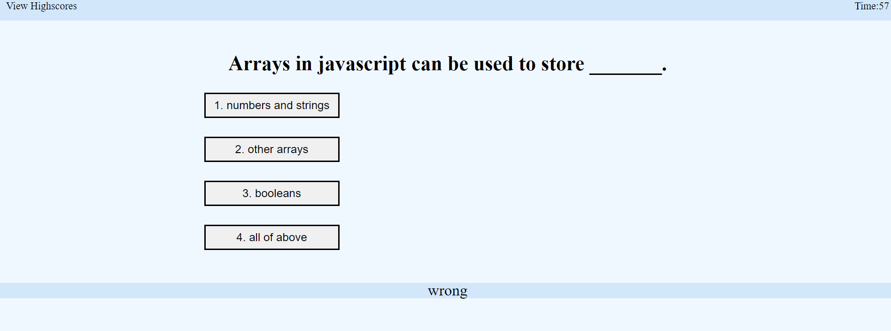

# API-Code-Quiz

# user can select answer for different quiz
# if answer incorrectly, time sburacted from the clock by 10s
# game over when all questions answered or time reach to 0
# initials and score can be stored and checked

# see link to the application

# attached a overview of Quiz page
# 

